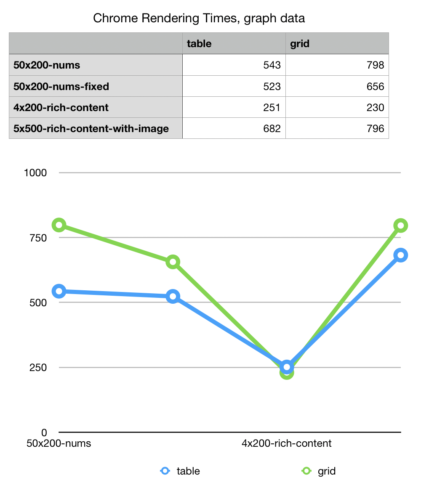

## Table vs css grid test

This is a set of files to test the render speed 
of css grids vs. tables. 

## The tests:

### Baseline: 50x200-nums

This test has the least defined or stressful requirements of all:
no predefined width, simple content. (although this may increase the times, 
as without predefined width, entire columns must be considered as a unit)
oveflow hidden;

### Fixed: 50x200-nums-fixed

The same data, with predefined widths of 50px. Overflow hidden.
Note, to get fixed columns to work we have to specify a table width. even
saying 100% (wrong) seems to work. 

### Rich Content: 4x200-rich-content 

Here we get into the "real world F**kedness" of web design: a table with 
html tags in the content, generating variable row height , and 
block level content inside cells. 

### Kitten Torture: 5x500-rich-content-with-image

The above tests, with more rows, and kitten images. The images don't have
width/height and are non-standard sizes (and not always present) generating
the maximum amount of chaos for the rendering as images load and resize the grid
after the initial pass.

## Results: Chrome

```
                          	table	grid
50x200-nums	                    543  798
50x200-nums-fixed	            523  656
4x200-rich-content	            251  230
5x500-rich-content-with-image	682  796

```



CASS Grid is , surprisingly, slower in nearly all categories; faster in 
one of the real world scenarios. However the times ranged from 16% better to 
47% worse, were generally within 10-20% of each other. 

The "single number" result is that CSS Grid is 20% slower than Tables. 

## Results: Firefox

```
                              table    grid
50x200-nums                      557    388
50x200-nums-fixed                287    266
4x200-rich-content               164    215
5x500-rich-content-with-image    320    548

```


On Firefox the results were more extreme but due to one single 
slow test (the last one) the net results are the same: 20% slower. 

## Summary

Its worth noting that all these tests have a large cell count but 
overall the rendering times were 0.3 seconds. Variation at this scale 
are not huge and vary significantly by browser. 

Chrome was on average half as fast as Firefox. 

More browser tests, and  more tests, are needed to be conclusive, but I think
its fair to say the two systems give comparable speeds.  
